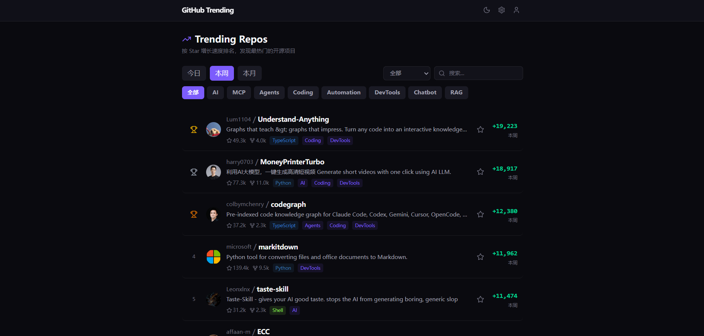
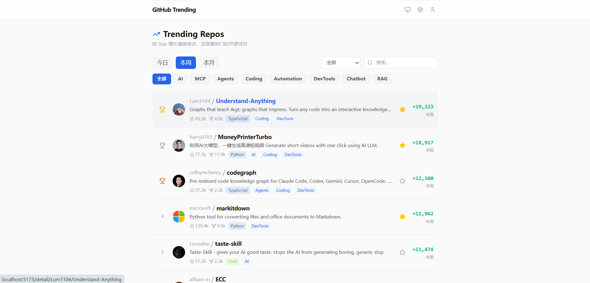
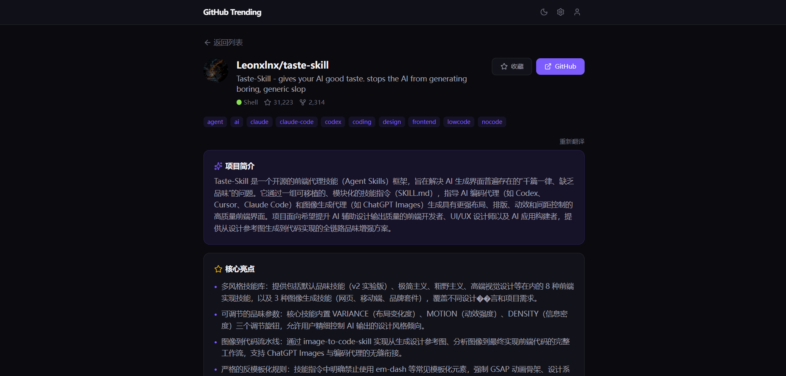
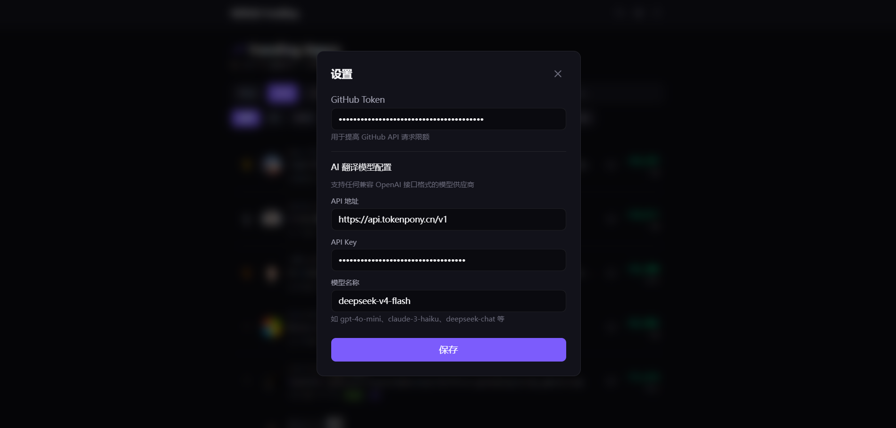
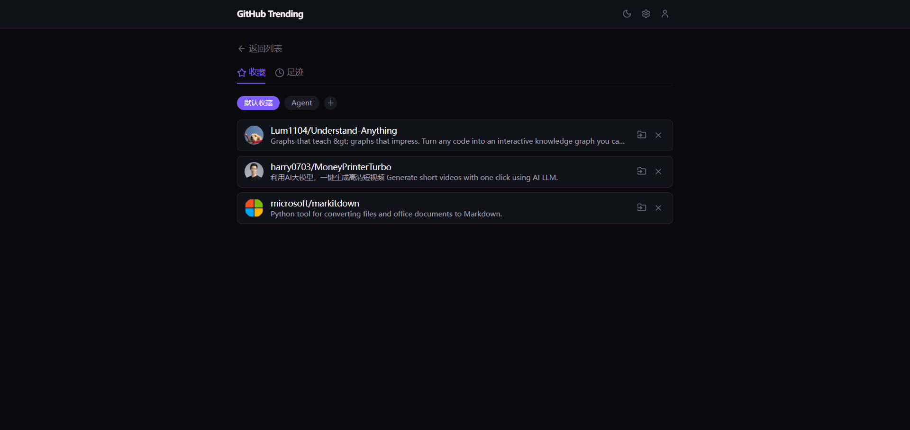

# GitHub Trending Dashboard

[English](#english) | [中文](#中文)

---

## English

### What is this?

GitHub Trending Dashboard is a modern web application that helps developers discover trending open-source projects on GitHub with **AI-powered translation**. It fetches the GitHub Trending page data, displays projects in a clean Linear-style UI, and uses AI models to translate project descriptions into Chinese — making it easy for non-English-speaking developers to quickly understand what each project does.

### Pain Points Solved

- **Language barrier**: GitHub Trending pages are mostly in English. This tool uses AI to translate project descriptions, README summaries, and key information into Chinese in real time.
- **Cluttered browsing experience**: The native GitHub Trending page lacks filtering, sorting, and pagination. This dashboard provides a clean, modern UI with powerful filtering by language/category, sorting by star growth, and pagination.
- **No favorites or tracking**: Easily bookmark interesting projects and revisit them later from a dedicated favorites page.
- **Context switching**: View detailed project information (README, stats, activity) without leaving the dashboard.

### Screenshots

| Home Page (Dark Mode) | Home Page (Light Mode) |
|:---:|:---:|
|  |  |

| Project Detail | Settings | Favorites |
|:---:|:---:|:---:|
|  |  |  |

### Features

- Fetches GitHub Trending data (daily/weekly/monthly)
- AI-powered translation of project descriptions and READMEs
- Light/Dark/System theme toggle
- Filter by programming language and category
- Sort by star growth with trophy icons for Top 3
- Pagination support
- Favorites/bookmarks system
- Detailed project view with README rendering
- Supports any OpenAI-compatible API provider

### Tech Stack

- **Frontend**: React 19 + TypeScript + Vite + Tailwind CSS
- **State Management**: Zustand
- **Backend**: Node.js + Express (API proxy server)
- **Routing**: React Router v7

### Requirements

- **Node.js** >= 18 (recommended: v20+)
- **npm** or **yarn** or **pnpm**
- **Network access** to GitHub (proxy supported, default: `http://127.0.0.1:7890`)

### Quick Start

```bash
# 1. Clone the repository
git clone https://github.com/guohedeizidu/Github_trending.git
cd Github_trending

# 2. Install dependencies
npm install

# 3. Start the backend API server
npm run server

# 4. In a new terminal, start the frontend dev server
npm run dev

# 5. Open browser at http://localhost:5173
```

Or start both at once:

```bash
npm start
```

### Configuration

Click the **Settings** (gear icon) in the app to configure:

#### GitHub Token

A GitHub Personal Access Token increases the API rate limit from 60 to 5000 requests/hour.

1. Go to [https://github.com/settings/tokens](https://github.com/settings/tokens)
2. Click **"Generate new token (classic)"**
3. Select scope: `public_repo` (read-only access to public repos is enough)
4. Copy the token and paste it into the Settings modal

#### AI Translation Model

This app supports **any OpenAI-compatible API provider**. Configure 3 fields in Settings:

| Field | Description | Example |
|-------|-------------|---------|
| API URL | The chat completions endpoint | `https://openrouter.ai/api/v1/chat/completions` |
| API Key | Your provider's API key | `sk-or-v1-xxxx` |
| Model | The model identifier | `deepseek/deepseek-chat` |

**Recommended Providers:**

| Provider | URL | Notes |
|----------|-----|-------|
| [OpenRouter](https://openrouter.ai/) | `https://openrouter.ai/api/v1/chat/completions` | Aggregates 100+ models, many free options |
| [Volcengine (火山引擎)](https://ai.volcengine.com/) | `https://ark.cn-beijing.volces.com/api/v3/chat/completions` | ByteDance's AI platform, Doubao models |
| [SiliconFlow (硅基流动)](https://siliconflow.cn/) | `https://api.siliconflow.cn/v1/chat/completions` | Chinese provider, affordable pricing |

### Proxy Configuration

The backend server uses a proxy for GitHub API requests (useful in regions with restricted access). Default proxy: `http://127.0.0.1:7890`.

To change it, set the environment variable:

```bash
HTTP_PROXY=http://your-proxy:port npm run server
```

---

## 中文

### 这是什么？

GitHub Trending Dashboard 是一个现代化的 Web 应用，帮助开发者发现 GitHub 上的热门开源项目，并提供 **AI 智能翻译**功能。它抓取 GitHub Trending 页面数据，以简洁的 Linear 风格 UI 展示项目列表，并使用 AI 模型将项目描述翻译成中文 —— 让中文开发者能快速了解每个项目的用途。

### 解决了什么痛点？

- **语言障碍**：GitHub Trending 页面几乎全是英文。本工具使用 AI 实时翻译项目描述、README 摘要等关键信息为中文。
- **浏览体验差**：原生 GitHub Trending 页面缺乏筛选、排序和分页功能。本面板提供了清爽的现代 UI，支持按语言/分类筛选、按 Star 增长排序、分页浏览。
- **无法收藏追踪**：可以轻松收藏感兴趣的项目，稍后在收藏页面回顾。
- **上下文切换频繁**：无需离开面板即可查看项目详情（README、统计数据、活跃度）。

### 截图

| 首页（深色模式） | 首页（浅色模式） |
|:---:|:---:|
|  |  |

| 项目详情 | 设置 | 收藏 |
|:---:|:---:|:---:|
|  |  |  |

### 功能特性

- 获取 GitHub Trending 数据（日/周/月维度）
- AI 驱动的项目描述和 README 翻译
- 浅色/深色/跟随系统主题切换
- 按编程语言和分类筛选
- 按 Star 增长排序，Top 3 显示奖杯图标
- 分页支持
- 收藏/书签系统
- 项目详情页，支持 README 渲染
- 支持任何兼容 OpenAI 接口的模型供应商

### 技术栈

- **前端**：React 19 + TypeScript + Vite + Tailwind CSS
- **状态管理**：Zustand
- **后端**：Node.js + Express（API 代理服务器）
- **路由**：React Router v7

### 环境要求

- **Node.js** >= 18（推荐 v20+）
- **npm** 或 **yarn** 或 **pnpm**
- **网络**：需要能访问 GitHub（支持代理，默认：`http://127.0.0.1:7890`）

### 快速开始

```bash
# 1. 克隆仓库
git clone https://github.com/guohedeizidu/Github_trending.git
cd Github_trending

# 2. 安装依赖
npm install

# 3. 启动后端 API 服务器
npm run server

# 4. 新开一个终端，启动前端开发服务器
npm run dev

# 5. 浏览器打开 http://localhost:5173
```

或者一键启动前后端：

```bash
npm start
```

### 配置说明

点击应用中的 **设置**（齿轮图标）进行配置：

#### GitHub Token 配置

GitHub Personal Access Token 可以将 API 请求限额从 60 次/小时提升到 5000 次/小时。

1. 访问 [https://github.com/settings/tokens](https://github.com/settings/tokens)
2. 点击 **"Generate new token (classic)"**
3. 勾选权限：`public_repo`（只需公开仓库只读权限即可）
4. 复制 Token，粘贴到应用设置弹窗中

#### AI 翻译模型配置

本应用支持**任何兼容 OpenAI 接口格式的模型供应商**。在设置中配置 3 个字段：

| 字段 | 说明 | 示例 |
|------|------|------|
| API 地址 | Chat Completions 接口地址 | `https://openrouter.ai/api/v1/chat/completions` |
| API Key | 供应商的 API 密钥 | `sk-or-v1-xxxx` |
| 模型名称 | 模型标识符 | `deepseek/deepseek-chat` |

**推荐供应商：**

| 供应商 | 地址 | 说明 |
|--------|------|------|
| [OpenRouter](https://openrouter.ai/) | `https://openrouter.ai/api/v1/chat/completions` | 聚合 100+ 模型，有免费额度 |
| [火山引擎](https://ai.volcengine.com/) | `https://ark.cn-beijing.volces.com/api/v3/chat/completions` | 字节跳动 AI 平台，豆包模型 |
| [硅基流动](https://siliconflow.cn/) | `https://api.siliconflow.cn/v1/chat/completions` | 国内供应商，价格实惠 |

### 代理配置

后端服务器使用代理访问 GitHub API（适用于网络受限的地区）。默认代理地址：`http://127.0.0.1:7890`。

修改代理地址：

```bash
HTTP_PROXY=http://your-proxy:port npm run server
```

---

## License

MIT
